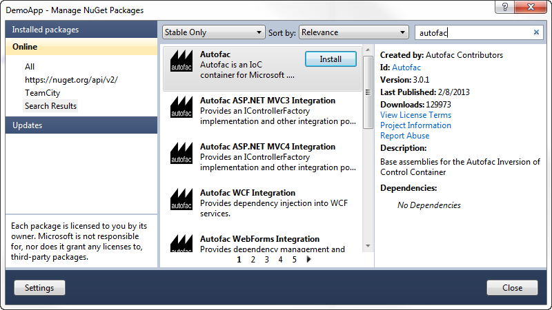

===============
Getting Started
===============

The basic pattern for integrating Autofac into your application is:
- Structure your app with *inversion of control* (IoC) in mind.
- Add Autofac references.
- At application startup...
- Create a `ContainerBuilder`.
- Register components.
- Build the container and store it for later use.
- During application execution...
- Create a lifetime scope from the container.
- Use the lifetime scope to resolve instances of the components.

This getting started guide walks you through these steps for a simple console application. Once you have the basics down, you can check out the rest of the wiki for more advanced usage and :doc:`integration information for WCF, ASP.NET, and other application types <integration/index>`.

Structuring the Application
===========================

The idea behind inversion of control is that, rather than tie the classes in your application together and let classes "new up" their dependencies, you switch it around so dependencies are instead passed in during class construction. `Martin Fowler has an excellent article explaining dependency injection/inversion of control <http://martinfowler.com/articles/injection.html>`_ if you want more on that.

For our sample app, we'll define a class that writes the current date out. However, we don't want it tied to the ``Console`` because we want to be able to test the class later or use it in a place where the console isn't available.

We'll also go as far as allowing the mechanism writing the date to be abstracted, so if we want to, later, swap in a version that writes *tomorrow's* date, it'll be a snap.

We'll do something like this::

    using System;

    namespace DemoApp
    {
      // This interface helps decouple the concept of
      // "writing output" from the Console class. We
      // don't really "care" how the Write operation
      // happens, just that we can write.
      public interface IOutput
      {
        void Write(string content);
      }

      // This implementation of the IOutput interface
      // is actually how we write to the Console. Technically
      // we could also implement IOutput to write to Debug
      // or Trace... or anywhere else.
      public class ConsoleOutput : IOutput
      {
        public void Write(string content)
        {
          Console.WriteLine(content);
        }
      }

      // This interface decouples the notion of writing
      // a date from the actual mechanism that performs
      // the writing. Like with IOutput, the process
      // is abstracted behind an interface.
      public interface IDateWriter
      {
        void WriteDate();
      }

      // This TodayWriter is where it all comes together.
      // Notice it takes a constructor parameter of type
      // IOutput - that lets the writer write to anywhere
      // based on the implementation. Further, it implements
      // WriteDate such that today's date is written out;
      // you could have one that writes in a different format
      // or a different date.
      public class TodayWriter : IDateWriter
      {
        private IOutput _output;
        public TodayWriter(IOutput output)
        {
          this._output = output;
        }

        public void WriteDate()
        {
          this._output.Write(DateTime.Today.ToShortDateString());
        }
      }
    }

Now that we have a reasonably structured (if contrived) set of dependencies, let's get Autofac in the mix!

Add Autofac References
======================

The first step is to add Autofac references to your project. For this example, we're only using core Autofac. :doc:`Other application types may use additional Autofac integration libraries. <integration/index>`.

The easiest way to do this is through NuGet. The "Autofac" package has all the core functionality you'll need.

Application Startup
===================

At application startup, you need to create a `ContainerBuilder` and register your :doc:`components <glossary>` with it. A *component* is an expression, .NET type, or other bit of code that exposes one or more *services* and can take in other *dependencies*.

In simple terms, think about a .NET type that implements an interface, like this::

    public class SomeType : IService
    {
    }

You could address that type in one of two ways:
- As the type itself, ``SomeType``
- As the interface, an ``IService``

In this case, the *component* is ``SomeType`` and the *services* it exposes are ``SomeType`` and ``IService``.

In Autofac, you'd register that with a ``ContainerBuilder`` something like this::

    // Create your builder.
    var builder = new ContainerBuilder();

    // Usually you're only interested in exposing the type
    // via its interface:
    builder.RegisterType<SomeType>().As<IService>();

    // However, if you want BOTH services (not as common)
    // you can say so:
    builder.RegisterType<SomeType>().AsSelf().As<IService>();

For our sample app, we need to register all of our components (classes) and expose their services (interfaces) so things can get wired up nicely.

We also need to store the container so it can be used to resolve types later.

::

    using System;
    using Autofac;

    namespace DemoApp
    {
      public class Program
      {
        private static IContainer Container { get; set; }

        static void Main(string[] args)
        {
          var builder = new ContainerBuilder();
          builder.RegisterType<ConsoleOutput>().As<IOutput>();
          builder.RegisterType<TodayWriter>().As<IDateWriter>();
          Container = builder.Build();

          // The WriteDate method is where we'll make use
          // of our dependency injection. We'll define that
          // in a bit.
          WriteDate();
        }
      }
    }

Now we have a *container* with all of the *components* registered and they're exposing the proper *services*. Let's make use of it.

Application Execution
=====================

During application execution, you'll need to make use of the components you registered. You do this by *resolving* them from a *lifetime scope*.

The container itself *is* a lifetime scope, and you can technically just resolve things right from the container. **It is not recommended to resolve from the container directly**, however.

When you resolve a component, depending on the :doc:`instance scope you define <lifetime/instance-scope>`, a new instance of the object gets created. (Resolving a component is roughly equivalent to calling "new" to instantiate a class. That's really, really oversimplifying it, but from an analogy perspective it's fine.) Some components may need to be disposed (like they implement ``IDisposable``) - :doc:`Autofac can handle disposing those components for you <lifetime/disposal>` when the lifetime scope is disposed.

However, the container lives for the lifetime of your application. If you resolve a lot of stuff directly from the container, you may end up with a lot of things hanging around waiting to be disposed. That's not good (and you may see a "memory leak" doing that).

Instead, create a *child lifetime scope* from the container and resolve from that. When you're done resolving components, dispose of the child scope and everything gets cleaned up for you.

(When you're working with the :doc:`Autofac integration libraries <integration/index>`, this child scope creation is largely done for you so you don't have to think about it.)

For our sample app, we'll implement the "WriteDate" method to get the writer from a scope and dispose of the scope when we're done.

::

    namespace DemoApp
    {
      public class Program
      {
        private static IContainer Container { get; set; }

        static void Main(string[] args)
        {
          // ...the stuff you saw earlier...
        }

        public static void WriteDate()
        {
          // Create the scope, resolve your IDateWriter,
          // use it, then dispose of the scope.
          using (var scope = Container.BeginLifetimeScope())
          {
            var writer = scope.Resolve<IDateWriter>();
            writer.WriteDate();
          }
        }
      }
    }

Now when you run your program...
- The "WriteDate" method asks Autofac for an ``IDateWriter``.
- Autofac sees that ``IDateWriter`` maps to ``TodayWriter`` so starts creating a ``TodayWriter``.
- Autofac sees that the ``TodayWriter`` needs an ``IOutput`` in its constructor.
- Autofac sees that ``IOutput`` maps to ``ConsoleOutput`` so creates a new ``ConsoleOutput`` instance.
- Autofac uses the new ``ConsoleOutput`` instance to finish constructing the ``TodayWriter``.
- Autofac returns the fully-constructed ``TodayWriter`` for "WriteDate" to consume.

Later, if you want your application to write a different date, you could implement a different ``IDateWriter`` and then change the registration at app startup. You don't have to change any other classes. Yay, inversion of control!

**Note: generally speaking, service location is largely considered an anti-pattern** `(see article) <http://blog.ploeh.dk/2010/02/03/ServiceLocatorIsAnAntiPattern.aspx>`_. That is, manually creating scopes everywhere and sprinkling use of the container through your code is not necessarily the best way to go. Using the :doc:`Autofac integration libraries <integration/index>` you usually won't have to do what we did in the sample app above. Instead, things get resolved from a central, "top level" location in the application and manual resolution is rare. Of course, how you design your app is up to you.

Going Further
=============

The sample app gives you an idea of how to use Autofac, but there's a lot more you can do.

- Check out the list of :doc:`integration libraries <integration/index>` to see how to integrate Autofac with your application.
- Learn about the :doc:`ways to register components <register/index>` that add flexibility.
- Learn about :doc:`Autofac configuration options <configuration/index>` that allow you to better manage your component registrations.

Need Help?
==========

- You can `ask questions on StackOverflow <http://stackoverflow.com/questions/tagged/autofac>`_.
- You can `participate in the Autofac Google Group <https://groups.google.com/forum/#forum/autofac>`_.
- There's an introductory `Autofac tutorial <http://www.codeproject.com/KB/architecture/di-with-autofac.aspx>`_ on CodeProject.

Building from Source
====================

The source code along with Visual Studio project files is available `on GitHub <https://github.com/autofac/Autofac>`_. Build instructions are in a README in the root of the code, and more information about the project is in the :doc:`Contributor Guide <contributors>`.