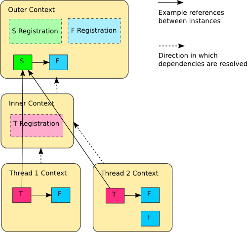

==============
Instance Scope
==============

Instance scope determines how an instance is shared between requests for the same service. Note that you should be familiar with :doc:`the concept of lifetime scopes <index>` to better understand what's happening here.

When a request is made for a service, Autofac can return a single instance (single instance scope), a new instance (per dependency scope), or a single instance within some kind of context, e.g. a thread or an HTTP request (per lifetime scope).

This applies to instances returned from an explicit `Resolve()` call as well as instances created internally by the container to satisfy the dependencies of another component.

.. contents::
  :local:

Instance Per Dependency
=======================

Also called 'transient' or 'factory' in other containers. Using per-dependency scope, **a unique instance will be returned from each request for a service.**

**This is the default** if no other option is specified.

.. sourcecode:: csharp

    var builder = new ContainerBuilder();

    // This...
    builder.RegisterType<Worker>();

    // ...is the same as this:
    builder.RegisterType<Worker>().InstancePerDependency();

When you resolve a component that is instance per dependency, you get a new one each time.

.. sourcecode:: csharp

    using(var scope = container.BeginLifetimeScope())
    {
      for(var i = 0; i < 100; i++)
      {
        // Every one of the 100 Worker instances
        // resolved in this loop will be brand new.
        var w = scope.Resolve<Worker>();
        w.DoWork();
      }
    }

Single Instance
===============

This is also known as 'singleton.' Using single instance scope, **one instance is returned from all requests in the root and all nested scopes**.

.. sourcecode:: csharp

    var builder = new ContainerBuilder();
    builder.RegisterType<Worker>().SingleInstance();

When you resolve a single instance component, you always get the same instance no matter where you request it.

.. sourcecode:: csharp

    // It's generally not good to resolve things from the
    // container directly, but for singleton demo purposes
    // we do...
    var root = container.Resolve<Worker>();

    // We can resolve the worker from any level of nested
    // lifetime scope, any number of times.
    using(var scope1 = container.BeginLifetimeScope())
    {
      for(var i = 0; i < 100; i++)
      {
        var w1 = scope1.Resolve<Worker>();
        using(var scope2 = scope1.BeginLifetimeScope())
        {
          var w2 = scope2.Resolve<Worker>();

          // root, w1, and w2 are always literally the
          // same object instance. It doesn't matter
          // which lifetime scope it's resolved from
          // or how many times.
        }
      }
    }

Instance Per Lifetime Scope
===========================

This scope applies to nested lifetimes. **A component with per-lifetime scope will have at most a single instance per nested lifetime scope.**

This is useful for objects specific to a single unit of work that may need to nest additional logical units of work. Each nested lifetime scope will get a new instance of the registered dependency.

.. sourcecode:: csharp

    var builder = new ContainerBuilder();
    builder.RegisterType<Worker>().InstancePerLifetimeScope();

When you resolve the instance per lifetime scope component, you get a single instance per nested scope (e.g., per unit of work).

.. sourcecode:: csharp

    using(var scope1 = container.BeginLifetimeScope())
    {
      for(var i = 0; i < 100; i++)
      {
        // Every time you resolve this from within this
        // scope you'll get the same instance.
        var w1 = scope1.Resolve<Worker>();
      }
    }

    using(var scope2 = container.BeginLifetimeScope())
    {
      for(var i = 0; i < 100; i++)
      {
        // Every time you resolve this from within this
        // scope you'll get the same instance, but this
        // instance is DIFFERENT than the one that was
        // used in the above scope. New scope = new instance.
        var w2 = scope2.Resolve<Worker>();
      }
    }

Instance Per Matching Lifetime Scope
====================================

This is similar to the 'instance per lifetime scope' concept above, but allows more precise control over instance sharing.

When you create a nested lifetime scope, you have the ability to "tag" or "name" the scope. **A component with per-matching-lifetime scope will have at most a single instance per nested lifetime scope that matches a given name.** This allows you to create a sort of "scoped singleton" where other nested lifetime scopes can share an instance of a component without declaring a global shared instance.

This is useful for objects specific to a single unit of work, e.g. an HTTP request, as a nested lifetime can be created per unit of work. If a nested lifetime is created per HTTP request, then any component with per-lifetime scope will have an instance per HTTP request. (More on per-request lifetime scope below.)

In most applications, only one level of container nesting will be sufficient for representing the scope of units of work. If more levels of nesting are required (e.g. something like global->request->transaction) components can be configured to be shared at a particular level in the hierarchy using tags.

.. sourcecode:: csharp

    var builder = new ContainerBuilder();
    builder.RegisterType<Worker>().InstancePerMatchingLifetimeScope("myrequest");

The supplied tag value is associated with a lifetime scope when you start it. **You will get an exception if you try to resolve a per-matching-lifetime-scope component when there's no correctly named lifetime scope.**

.. sourcecode:: csharp

    // Create the lifetime scope using the tag.
    using(var scope1 = container.BeginLifetimeScope("myrequest"))
    {
      for(var i = 0; i < 100; i++)
      {
        var w1 = scope1.Resolve<Worker>();
        using(var scope2 = scope1.BeginLifetimeScope())
        {
          var w2 = scope2.Resolve<Worker>();

          // w1 and w2 are always the same object
          // instance because the component is per-matching-lifetime-scope,
          // so it's effectively a singleton within the
          // named scope.
        }
      }
    }

    // Create another lifetime scope using the tag.
    using(var scope3 = container.BeginLifetimeScope("myrequest"))
    {
      for(var i = 0; i < 100; i++)
      {
        // w3 will be DIFFERENT than the worker resolved in the
        // earlier tagged lifetime scope.
        var w3 = scope3.Resolve<Worker>();
        using(var scope4 = scope1.BeginLifetimeScope())
        {
          var w4 = scope4.Resolve<Worker>();

          // w3 and w4 are always the same object because
          // they're in the same tagged scope, but they are
          // NOT the same as the earlier workers (w1, w2).
        }
      }
    }

    // You can't resolve a per-matching-lifetime-scope component
    // if there's no matching scope.
    using(var noTagScope = container.BeginLifetimeScope())
    {
      // This throws an exception because this scope doesn't
      // have the expected tag and neither does any parent scope!
      var fail = noTagScope.Resolve<Worker>();
    }

Instance Per Request
====================

Some application types naturally lend themselves to "request" type semantics, for example ASP.NET :doc:`web forms <../integration/webforms>` and :doc:`MVC <../integration/mvc>` applications. In these application types, it's helpful to have the ability to have a sort of "singleton per request."

**Instance per request builds on top of instance per matching lifetime scope** by providing a well-known lifetime scope tag, a registration convenience method, and integration for common application types. Behind the scenes, though, it's still just instance per matching lifetime scope.

What this means is that if you try to resolve components that are registered as instance-per-request but there's no current request... you're going to get an exception.

:doc:`There is a detailed FAQ outlining how to work with per-request lifetimes. <../faq/per-request-scope>`

.. sourcecode:: csharp

    var builder = new ContainerBuilder();
    builder.RegisterType<Worker>().InstancePerRequest();

Instance Per Owned
==================

The `Owned<T>` :doc:`implicit relationship type <../resolve/relationships>` creates new nested lifetime scopes. It is possible to scope dependencies to the owned instance using the instance-per-owned registrations.

.. sourcecode:: csharp

    var builder = new ContainerBuilder();
    builder.RegisterType<MessageHandler>();
    builder.RegisterType<ServiceForHandler>().InstancePerOwned<MessageHandler>();

In this example the ``ServiceForHandler`` service will be scoped to the lifetime of the owned ``MessageHandler`` instance.

.. sourcecode:: csharp

    using(var scope = container.BeginLifetimeScope())
    {
      // The message handler itself as well as the
      // resolved dependent ServiceForHandler service
      // is in a tiny child lifetime scope under
      // "scope." Note that resolving an Owned<T>
      // means YOU are responsible for disposal.
      var h1 = scope.Resolve<Owned<MessageHandler>>();
      h1.Dispose();
    }

Thread Scope
============

Autofac can enforce that objects bound to one thread will not satisfy the dependencies of a component bound to another thread. While there is not a convenience method for this, you can do it using lifetime scopes.

.. sourcecode:: csharp

    var builder = new ContainerBuilder();
    builder.RegisterType<MyThreadScopedComponent>()
           .InstancePerLifetimeScope();
    var container = builder.Build();

Then, each thread gets its own lifetime scope:

.. sourcecode:: csharp

    void ThreadStart()
    {
      using (var threadLifetime = container.BeginLifetimeScope())
      {
        var thisThreadsInstance = threadLifetime.Resolve<MyThreadScopedComponent>();
      }
    }

**IMPORTANT: Given the multithreaded scenario, you must be very careful that the parent scope doesn't get disposed out from under the spawned thread.** You can get into a bad situation where components can't be resolved if you spawn the thread and then dispose the parent scope.

Each thread executing through ``ThreadStart()`` will then get its own instance of ``MyThreadScopedComponent`` - which is essentially a "singleton" in the lifetime scope. Because scoped instances are never provided to outer scopes, it is easier to keep thread components separated.

You can inject a parent lifetime scope into the code that spawns the thread by taking an ``ILifetimeScope`` parameter. Autofac knows to automatically inject the current lifetime scope and you can create a nested scope from that.

.. sourcecode:: csharp

    public class ThreadCreator
    {
      private ILifetimeScope _parentScope;

      public ThreadCreator(ILifetimeScope parentScope)
      {
        this._parentScope = parentScope;
      }

      public void ThreadStart()
      {
        using (var threadLifetime = this._parentScope.BeginLifetimeScope())
        {
          var thisThreadsInstance = threadLifetime.Resolve<MyThreadScopedComponent>();
        }
      }
    }

If you would like to enforce this even more heavily, use instance per matching lifetime scope (see above) to associate the thread-scoped components with the inner lifetime (they'll still have dependencies from the factory/singleton components in the outer container injected.) The result of this approach looks something like:

The 'contexts' in the diagram are the containers created with ``BeginLifetimeScope()``.
